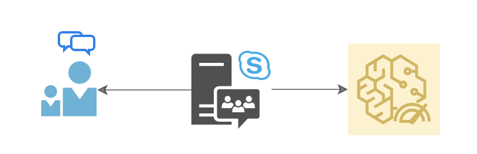
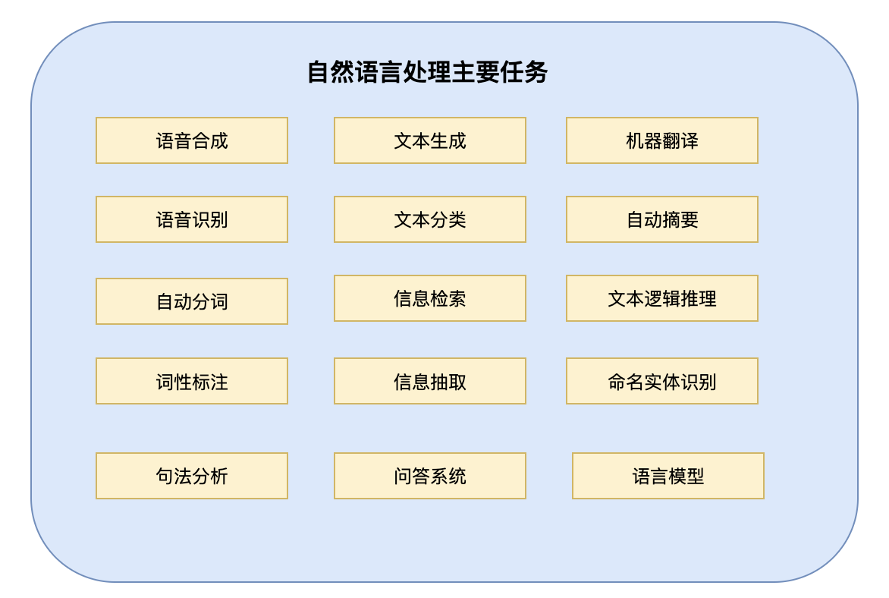

# NLP100 速问速答

   * [NLP100 速问速答](#nlp100-速问速答)
      * [项目缘由](#项目缘由)
      * [速问速答](#速问速答)
         * [什么是自然语言处理](#什么是自然语言处理)
         * [自然语言处理的主要任务有哪些](#自然语言处理的主要任务有哪些)
         * [文本分词的常见方法有哪些](#文本分词的常见方法有哪些)
         * [常见的分词工具包有哪些](#常见的分词工具包有哪些)
      * [学习交流群](#学习交流群)
      * [版权问题](#版权问题)
      * [参考文献](#参考文献)

## 项目缘由

很多人觉得 NLP 领域很大很难，想要入门，却很难找到切入点。

其实，想要入门一个新的领域，最重要的，是先对这个行业有清晰的认知。

一个问题，一句回答，一张图片，简单粗暴的将 NLP 轮廓呈现在你面前。

## 速问速答

### 什么是自然语言处理

英语称谓为 Natural Language Processing，简称 NLP。**自然语言**指的是生活中人们使用的语言，如中文、英语，**处理**包含了对语言文本的分析、理解和生成等部分。

### 自然语言处理的主要任务有哪些

自然语言处理的主要任务有：语音合成、语音识别、自动分词、词性标注、句法分析、文本生成、文本分类、信息检索、信息抽取、问答系统、机器翻译、自动摘要、文本逻辑推理、命名实体识别、语言模型等。

### 文本分词的常见方法有哪些

- 基于词典的分词算法
    - 正向最大匹配法
    - 逆向最大匹配法
    - 双向匹配法
- 基于统计的机器学习算法
    - HMM 
    - CRF 
    - SVM
    - 深度学习

### 常见的分词工具包有哪些

- [Hanlp分词器](https://github.com/hankcs/HanLP)
- [结巴分词](https://github.com/yanyiwu/cppjieba)
- [Stanford分词器](https://nlp.stanford.edu/software/segmenter.shtml)
- [清华大学THULAC](https://github.com/thunlp/THULAC)
- [哈工大LTP](https://github.com/thunlp/THULAC)
- [中科院计算所NLPIR](http://ictclas.nlpir.org/nlpir/)

### 词的数学表示有哪些

### 有名的 NLP 工具包

NLP 工具包一般包含了常见的文本处理功能，例如文本分词、词性标注、语法分析、文本分类等。国内外有一些有名的 NLP 工具包，如下：

- [NLTK](https://www.nltk.org/) 该工具包常用于教学，官方的学习资料可[在线阅读](http://www.nltk.org/book/)；
- [CoreNlP]()

## 学习交流群

添加微信好友 `2842721963`，备注 `nlp100`，加入学习交流群。

## 版权问题

未经授权，禁止转载，翻版必究。

## 参考文献

- [维基百科](https://zh.wikipedia.org/wiki/%E8%87%AA%E7%84%B6%E8%AF%AD%E8%A8%80%E5%A4%84%E7%90%86)